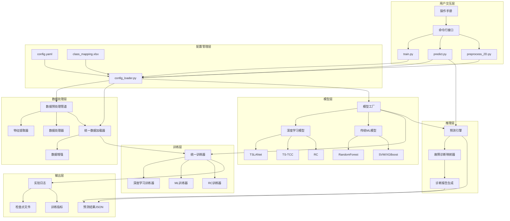
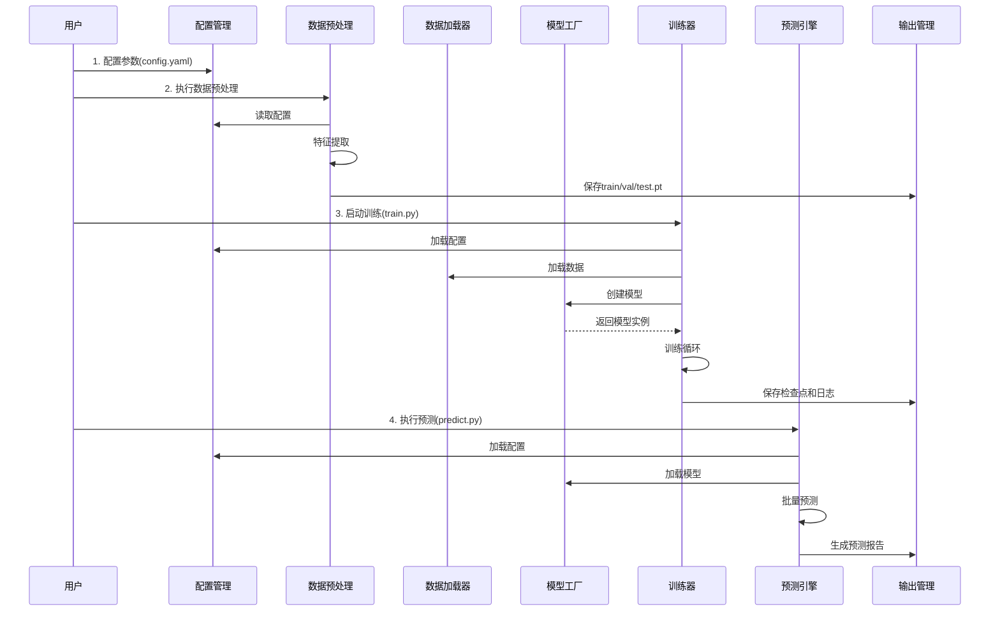

# 系统框架说明文档

> 本文档为故障诊断机器学习/深度学习平台的系统框架说明，旨在帮助开发者理解系统架构和各模块之间的关系。

---

## 1. 系统整体架构

### 1.1 架构概述

本系统是一个面向工业设备故障诊断的机器学习平台，采用分层模块化架构设计。系统从上到下分为七个核心层次，各层职责明确、接口清晰，支持从原始数据预处理到故障诊断报告生成的完整工作流。

系统支持多种模型类型，包括深度学习模型（TSLANet、TS-TCC、RC）和传统机器学习模型（RandomForest、SVM、XGBoost等），通过统一的配置管理和模型工厂机制实现灵活的模型切换与参数调整。

### 1.2 架构层次说明

#### 用户交互层

用户交互层是系统的入口，提供命令行接口供用户执行各项操作。主要包含以下脚本：

- **train.py**：模型训练入口，支持多种训练模式（监督学习、自监督预训练、微调等）
- **predict.py**：模型预测入口，支持内置数据集和外部数据的推理
- **preprocess_2D.py**：2D数据预处理脚本，从原始CSV提取特征并生成训练数据
- **preprocess_3D.py**：3D数据预处理脚本
- **prepare_dp_data.py**：深度学习数据准备脚本
- **prepare_ml_data.py**：传统机器学习数据准备脚本

用户通过命令行参数或配置文件控制系统行为，操作手册提供详细的使用指南。

#### 配置管理层

配置管理层负责统一管理系统的所有配置参数，是连接用户交互层与底层处理模块的桥梁。核心组件包括：

- **config.yaml**：主配置文件，定义实验参数、训练模式、模型选择、数据集配置等
- **preprocess.yaml / preprocess_2D.yaml**：数据预处理专用配置文件
- **config_loader.py**（`configs/config_loader.py`）：配置加载器，负责解析YAML文件、处理路径占位符、提供模型特定配置
- **class_mapping.xlsx**（`configs/class_mapping.xlsx`）：故障类别映射表，定义标签与故障原因的对应关系

配置管理层通过 `ConfigLoader` 向下游模块提供统一的配置接口，支持命令行参数覆盖配置文件中的默认值。

#### 数据处理层

数据处理层负责将原始传感器数据转换为模型可用的特征张量，包含两个主要子系统：

- **数据预处理管道**（`data_preprocessing/pipeline.py`）：`FaultDiagnosisPipeline` 类，协调特征提取和数据处理的完整流程
  - **特征提取器**（`data_preprocessing/feature_extractor.py`）：从时序数据中提取多维特征（基础统计、动态特征、频域特征、稳定性、周期性等）
  - **数据处理器**（`data_preprocessing/data_processor.py`）：执行数据清洗、时间窗口截取、异常值处理等
- **统一数据加载器**（`data/unified_dataloader.py`）：`UnifiedDataset` 类和 `get_dataloader` 函数，为不同模型提供统一的数据加载接口
  - **数据增强**（`data/augmentations.py`）：支持Jitter、Scaling、Time Warping、Permutation等增强策略（主要用于TS-TCC自监督模式）

#### 模型层

模型层通过工厂模式统一管理所有模型的创建和实例化，支持动态注册和灵活扩展：

- **模型工厂**（`models/model_factory.py`）：`ModelFactory` 类，提供 `create_model`、`register`、`list_models` 等接口
- **深度学习模型**：
  - **TSLANet**（`models/tslanet.py`）：基于时序自适应轻量注意力网络的分类模型
  - **TS-TCC**（`models/ts_tcc.py`）：时序对比编码模型，支持自监督预训练
  - **RC**（`models/rc_model.py`）：储备池计算模型
- **传统机器学习模型**（`models/ml_models.py`）：RandomForest、SVM、XGBoost、LightGBM、KNN、LogisticRegression等
- **注意力机制**（`models/attention.py`）：为深度学习模型提供注意力模块支持

#### 训练层

训练层提供统一的训练流程管理，根据模型类型自动选择合适的训练器：

- **统一训练器**（`trainers/unified_trainer.py`）：`UnifiedTrainer` 类，管理深度学习模型的训练循环、损失计算、反向传播、学习率调度、检查点保存等
- **ML训练器**（`trainers/ml_trainer.py`）：`MLTrainer` 类，管理传统机器学习模型的训练（fit/predict范式）
- **RC训练器**（`trainers/rc_trainer.py`）：`RCTrainer` 类，管理储备池计算模型的特殊训练流程

训练层还依赖以下工具模块（`utils/`）：
- 损失函数（`utils/loss.py`）、评估指标（`utils/metrics.py`）、掩码工具（`utils/masking.py`）、日志记录（`utils/logger.py`）

#### 推理层

推理层负责加载训练好的模型执行预测，并将预测结果映射为可理解的故障诊断信息：

- **预测引擎**（`predict.py` 中的 `predict_batch` 函数）：支持批量预测和迭代预测，自动适配不同模型类型
- **故障诊断映射器**（`utils/fault_diagnosis_mapper.py`）：`FaultDiagnosisMapper` 类，将数字标签映射为故障原因和处理方案
- **诊断报告生成**：将预测结果、置信度、故障诊断信息整合为结构化的JSON报告

#### 输出层

输出层管理系统产生的所有输出文件，按实验组织存储：

- **实验日志**（`experiments_logs/`）：按实验编号和运行编号组织的目录结构
  - **检查点文件**：`ckp_best.pt`（最佳模型）、`ckp_last.pt`（最后一轮模型）
  - **训练指标**：`metrics.csv`（训练/验证损失和准确率）、`classification_report.xlsx`（分类报告）、`confusion_matrix.png`（混淆矩阵图）
  - **训练日志**：`.log` 文件，记录训练过程的详细信息
  - **配置副本**：`config.yaml`，保存本次实验使用的完整配置
- **预测结果JSON**：包含预测标签、概率分布、故障诊断信息的结构化输出文件

### 1.3 系统架构图



### 1.4 层间交互关系

| 上游层 | 下游层 | 交互方式 | 说明 |
|--------|--------|----------|------|
| 用户交互层 | 配置管理层 | 脚本调用 `ConfigLoader` | 所有入口脚本首先加载配置 |
| 配置管理层 | 数据处理层 | 传递配置字典 | 预处理管道和数据加载器依赖配置参数 |
| 配置管理层 | 模型层 | 传递模型配置 | 模型工厂根据配置创建对应模型实例 |
| 数据处理层 | 训练层 | 提供 `DataLoader` | 统一数据加载器为训练器提供批次数据 |
| 模型层 | 训练层 | 提供模型实例 | 模型工厂创建的模型传入训练器 |
| 模型层 | 推理层 | 提供模型实例 | 预测引擎加载模型执行推理 |
| 训练层 | 输出层 | 写入文件 | 训练器保存检查点、日志和指标 |
| 推理层 | 输出层 | 写入文件 | 预测引擎生成预测结果JSON |


---

## 2. 主要工作流程

### 2.1 工作流程概述

系统的主要工作流程分为四个阶段：**配置** → **数据预处理** → **模型训练** → **模型预测**。各阶段通过配置管理层统一协调，数据和模型通过输出管理层进行持久化存储。

以下时序图展示了用户与各核心模块之间的完整交互过程：

### 2.2 工作流程时序图



### 2.3 各阶段说明

#### 阶段一：配置（步骤1）

用户通过编辑 `config.yaml` 或 `preprocess.yaml` 配置文件设定系统参数。配置管理模块（`ConfigLoader`）负责解析YAML文件、替换路径占位符，并向下游模块提供统一的配置接口。所有后续阶段均依赖配置管理层获取运行参数。

#### 阶段二：数据预处理（步骤2）

用户执行预处理脚本（如 `preprocess_2D.py`），数据预处理模块首先从配置管理层读取预处理参数，然后对原始CSV数据执行特征提取（基础统计、动态特征、频域特征等），最终将处理后的数据按8:1:1比例划分为训练集、验证集和测试集，以 `.pt` 格式保存至输出管理层。

#### 阶段三：模型训练（步骤3）

用户通过 `train.py` 启动训练流程。训练器首先从配置管理层加载训练参数，然后通过数据加载器加载预处理后的 `.pt` 数据，再通过模型工厂创建指定的模型实例。模型工厂根据配置返回对应的模型（深度学习或传统ML模型）。训练器执行训练循环（前向传播、损失计算、反向传播、参数更新），并将检查点文件和训练日志保存至输出管理层。

#### 阶段四：模型预测（步骤4）

用户通过 `predict.py` 执行预测。预测引擎从配置管理层加载配置，通过模型工厂加载已训练的模型检查点，对输入数据执行批量预测，最终通过故障诊断映射器将预测结果转换为包含故障原因和处理方案的诊断报告，保存至输出管理层。


---

## 3. 核心模块接口说明

本节为系统中每个核心模块提供详细的接口说明，包括输入参数、输出格式和职责描述。

### 3.1 ConfigLoader（配置加载器）

**所在文件**: `configs/config_loader.py`

**职责描述**: 统一管理系统的所有配置参数。负责加载和解析YAML配置文件，处理路径占位符替换（如 `__PROJECT_ROOT__`），并向下游模块提供统一的配置访问接口。配置加载器在模块导入时自动执行加载，以单例模式对外提供 `CONFIG` 对象。

#### 3.1.1 `_load_yaml(yaml_path: str) -> Dict[str, Any]`

**功能**: 加载并解析指定路径的YAML配置文件。

| 项目 | 说明 |
|------|------|
| **输入参数** | `yaml_path` (str): YAML配置文件的路径 |
| **输出格式** | `Dict[str, Any]`: 解析后的配置字典，包含所有配置项的原始值 |
| **异常处理** | 文件不存在时抛出 `FileNotFoundError`；YAML格式错误时抛出 `yaml.YAMLError` |

#### 3.1.2 `_resolve_placeholders(config: Dict) -> Dict`

**功能**: 递归遍历配置字典，将所有路径占位符替换为实际路径值。

| 项目 | 说明 |
|------|------|
| **输入参数** | `config` (Dict): 包含占位符的原始配置字典 |
| **输出格式** | `Dict`: 占位符已替换为实际路径的配置字典 |
| **替换规则** | `__PROJECT_ROOT__` → 项目根目录的绝对路径 |

#### 3.1.3 `get_model_config(model_name: str, dataset_name: str) -> Dict`

**功能**: 根据模型名称和数据集名称，从全局配置中提取该模型在该数据集上的完整配置参数。

| 项目 | 说明 |
|------|------|
| **输入参数** | `model_name` (str): 模型名称，如 `'TSLANet'`、`'TS-TCC'`、`'RandomForest'` 等 |
|  | `dataset_name` (str): 数据集名称，如 `'chaosu'` |
| **输出格式** | `Dict`: 合并后的模型配置字典，包含数据集参数（`input_channels`、`seq_len`、`num_classes` 等）和模型特定参数 |
| **说明** | 该函数定义在 `models/model_factory.py` 中，将数据集配置与模型特定配置合并为统一的配置字典 |

---

### 3.2 FaultDiagnosisPipeline（数据预处理管道）

**所在文件**: `data_preprocessing/pipeline.py`

**职责描述**: 协调从原始CSV传感器数据到训练就绪张量数据的完整预处理流程。包括数据加载与验证、时间窗口截取、多维特征提取（基础统计、动态特征、频域特征、稳定性、周期性）、数据清洗与异常处理、批量处理与标签编码，最终生成PyTorch张量格式的数据文件。

#### 3.2.1 `run(csv_data_or_path, fault_time, timestamp_range) -> Dict[str, Any]`

**功能**: 对单个CSV数据文件执行完整的特征提取流程。

| 项目 | 说明 |
|------|------|
| **输入参数** | `csv_data_or_path` (Union[str, DataFrame]): CSV文件路径或已加载的DataFrame对象 |
|  | `fault_time` (float): 故障发生时间点，默认使用配置中的 `DEFAULT_FAULT_TIME` |
|  | `timestamp_range` (Tuple[float, float]): 时间窗口范围，用于截取有效数据段 |
| **输出格式** | `Dict[str, Any]`: 处理结果字典，包含以下字段： |
|  | - `status` (str): `"success"` 或 `"failed"` |
|  | - `features` (np.ndarray): 特征向量，维度为329或569（成功时） |
|  | - `processed_data` (DataFrame): 处理后的数据（成功时） |
|  | - `error_code` (str): 错误码，如 `ERR_DAT_101`（失败时） |
|  | - `message` (str): 错误描述信息（失败时） |

#### 3.2.2 `process_batch_to_pt(data_list, label_list, output_path) -> Dict[str, Any]`

**功能**: 批量处理多个CSV文件，将结果按8:1:1比例划分为训练集/验证集/测试集，并保存为 `.pt` 文件。

| 项目 | 说明 |
|------|------|
| **输入参数** | `data_list` (List[str]): CSV文件路径列表 |
|  | `label_list` (List[Any]): 对应的标签列表，与 `data_list` 一一对应 |
|  | `output_path` (Optional[str]): 输出目录路径，为 `None` 时使用默认路径 |
| **输出格式** | `Dict[str, Any]`: 批处理结果字典，包含以下字段： |
|  | - `status` (str): `"success"` 或 `"failed"` |
|  | - `total` (int): 总样本数 |
|  | - `success` (int): 成功处理的样本数 |
|  | - `failed` (int): 处理失败的样本数 |
|  | - `output_files` (Dict): 生成的文件路径（`train.pt`、`val.pt`、`test.pt`） |

---

### 3.3 UnifiedDataset / get_dataloader（统一数据加载器）

**所在文件**: `data/unified_dataloader.py`

**职责描述**: 为不同模型提供统一的数据加载接口。负责加载 `.pt` 格式的训练/验证/测试数据，处理数据维度转换（确保通道在第二维），为TSLANet执行序列填充（对齐到 `patch_size` 倍数），为TS-TCC自监督模式提供数据增强（Jitter、Scaling、Time Warping、Permutation），并创建 `DataLoader` 实例支持批处理和随机打乱。

#### 3.3.1 `UnifiedDataset.__init__(data_file, config, training_mode, model_name)`

**功能**: 初始化统一数据集，加载数据并根据模型需求进行预处理。

| 项目 | 说明 |
|------|------|
| **输入参数** | `data_file` (Dict): 数据文件字典，包含 `'samples'` (Tensor) 和 `'labels'` (Tensor) |
|  | `config` (Dict): 配置字典，包含模型和训练相关参数 |
|  | `training_mode` (str): 训练模式，如 `'supervised'`、`'self_supervised'` 等 |
|  | `model_name` (str): 模型名称，如 `'TSLANet'`、`'TS-TCC'` |
| **内部处理** | 自动调整维度使通道位于第二维；TS-TCC自监督模式下自动生成增强数据 |

#### 3.3.2 `UnifiedDataset.__getitem__(index: int) -> Tuple[Tensor, ...]`

**功能**: 获取指定索引的单个样本。

| 项目 | 说明 |
|------|------|
| **输入参数** | `index` (int): 样本索引 |
| **输出格式** | `Tuple[Tensor, Tensor, Tensor, Tensor]`: 四元组 `(x_data, y_data, aug1, aug2)` |
|  | - TS-TCC自监督模式: `aug1`、`aug2` 为增强后的数据 |
|  | - 其他模式: `aug1`、`aug2` 与 `x_data` 相同 |

#### 3.3.3 `UnifiedDataset.__len__() -> int`

**功能**: 返回数据集中的样本总数。

| 项目 | 说明 |
|------|------|
| **输入参数** | 无 |
| **输出格式** | `int`: 数据集样本数量 |

#### 3.3.4 `get_dataloader(data_path, config, training_mode, model_name) -> Tuple[DataLoader, ...]`

**功能**: 加载指定路径下的 `train.pt`、`val.pt`、`test.pt` 数据文件，创建并返回三个 `DataLoader` 实例。

| 项目 | 说明 |
|------|------|
| **输入参数** | `data_path` (str): 数据集目录路径，该目录下应包含 `train.pt`、`val.pt`、`test.pt` |
|  | `config` (Dict): 配置字典，包含 `batch_size`、`patch_size`（TSLANet用）等参数 |
|  | `training_mode` (str): 训练模式 |
|  | `model_name` (str): 模型名称 |
| **输出格式** | `Tuple[DataLoader, DataLoader, DataLoader]`: `(train_loader, val_loader, test_loader)` |
| **特殊处理** | TSLANet模型自动将序列长度填充至 `patch_size` 的整数倍；批次大小不足时自动缩小 |

---

### 3.4 ModelFactory（模型工厂）

**所在文件**: `models/model_factory.py`

**职责描述**: 通过工厂模式统一管理所有模型的注册、创建和实例化。支持深度学习模型（TSLANet、TS-TCC、base_CNN、RC）和传统机器学习模型（RandomForest、SVM、XGBoost、LightGBM、KNN、LogisticRegression）的动态注册和灵活扩展。自动处理模型的设备分配（深度学习→GPU，传统ML→CPU）和辅助模型的创建（如TS-TCC的TC模块）。

#### 3.4.1 `ModelFactory.register(model_name: str) -> Callable`

**功能**: 类方法装饰器，用于将模型类注册到工厂的模型注册表中。

| 项目 | 说明 |
|------|------|
| **输入参数** | `model_name` (str): 注册的模型名称标识符 |
| **输出格式** | `Callable`: 装饰器函数，返回被装饰的模型类本身 |
| **使用方式** | `@ModelFactory.register('TSLANet')` 装饰模型类定义 |

#### 3.4.2 `ModelFactory.create_model(model_name, config, device) -> Tuple[nn.Module, Optional[nn.Module]]`

**功能**: 根据模型名称和配置创建模型实例，自动处理设备分配和辅助模型创建。

| 项目 | 说明 |
|------|------|
| **输入参数** | `model_name` (str): 模型名称，必须在已注册的模型列表中 |
|  | `config` (Dict[str, Any]): 模型配置字典，包含 `num_classes`、`seq_len`、`num_channels` 等参数 |
|  | `device` (str): 运行设备，`'cuda'` 或 `'cpu'`，默认 `'cuda'` |
| **输出格式** | `Tuple[nn.Module, Optional[nn.Module]]`: `(model, auxiliary_model)` |
|  | - `model`: 主模型实例，已移动到指定设备 |
|  | - `auxiliary_model`: 辅助模型（TS-TCC返回TC模块，其他模型返回 `None`） |
| **异常处理** | 模型名称未注册时尝试自动注册；自动注册失败时抛出 `ValueError` |

#### 3.4.3 `ModelFactory.list_models() -> List[str]`

**功能**: 列出所有已注册的模型名称。

| 项目 | 说明 |
|------|------|
| **输入参数** | 无 |
| **输出格式** | `List[str]`: 已注册的模型名称列表 |

---

### 3.5 UnifiedTrainer（统一训练器）

**所在文件**: `trainers/unified_trainer.py`

**职责描述**: 提供统一的深度学习模型训练流程管理。负责管理训练循环（epoch迭代）、损失函数计算（监督/自监督）、反向传播和参数更新、学习率调度、模型评估和指标计算、检查点保存和加载、训练日志记录。支持多种训练模式：`random_init`（随机初始化）、`supervised`（监督学习）、`self_supervised`（自监督预训练）、`fine_tune`（微调）、`train_linear`（冻结主干仅训练分类头）。

#### 3.5.1 `UnifiedTrainer.__init__(...)`

**功能**: 初始化训练器，配置模型、优化器、设备和训练参数。

| 项目 | 说明 |
|------|------|
| **输入参数** | `model` (nn.Module): 主模型实例 |
|  | `auxiliary_model` (Optional[nn.Module]): 辅助模型（如TS-TCC的TC模块），可为 `None` |
|  | `model_optimizer` (Optimizer): 主模型优化器 |
|  | `aux_optimizer` (Optional[Optimizer]): 辅助模型优化器，可为 `None` |
|  | `device` (str): 运行设备 |
|  | `logger` (Logger): 日志记录器 |
|  | `config` (Dict): 训练配置字典，包含 `num_epochs`、`learning_rate` 等 |
|  | `experiment_log_dir` (str): 实验日志保存目录 |
|  | `training_mode` (str): 训练模式 |
|  | `model_name` (str): 模型名称 |

#### 3.5.2 `train(train_loader, val_loader, test_loader) -> None`

**功能**: 执行完整的模型训练流程，包括多轮训练、验证评估和检查点保存。

| 项目 | 说明 |
|------|------|
| **输入参数** | `train_loader` (DataLoader): 训练数据加载器 |
|  | `val_loader` (DataLoader): 验证数据加载器 |
|  | `test_loader` (DataLoader): 测试数据加载器 |
| **输出格式** | `None`（无返回值，结果通过文件保存） |
| **副作用** | 更新模型参数；保存最佳检查点 `ckp_best.pt` 和最终检查点 `ckp_last.pt`；记录训练日志 |

#### 3.5.3 `train_epoch(train_loader) -> Tuple[float, float]`

**功能**: 执行单个epoch的训练，遍历所有训练批次。

| 项目 | 说明 |
|------|------|
| **输入参数** | `train_loader` (DataLoader): 训练数据加载器 |
| **输出格式** | `Tuple[float, float]`: `(avg_loss, avg_accuracy)` — 该epoch的平均损失和平均准确率 |
| **异常处理** | 损失值为NaN/Inf时跳过该批次并记录警告 |

#### 3.5.4 `evaluate(data_loader) -> Tuple[float, float, np.ndarray, np.ndarray]`

**功能**: 在指定数据集上评估模型性能。

| 项目 | 说明 |
|------|------|
| **输入参数** | `data_loader` (DataLoader): 评估数据加载器（验证集或测试集） |
| **输出格式** | `Tuple[float, float, np.ndarray, np.ndarray]`: |
|  | - `avg_loss` (float): 平均损失 |
|  | - `avg_accuracy` (float): 平均准确率 |
|  | - `pred_labels` (np.ndarray): 预测标签数组 |
|  | - `true_labels` (np.ndarray): 真实标签数组 |

#### 3.5.5 `save_checkpoint(save_dir, epoch, is_best) -> None`

**功能**: 保存模型检查点，包含模型参数、优化器状态和训练元数据。

| 项目 | 说明 |
|------|------|
| **输入参数** | `save_dir` (str): 检查点保存目录，默认 `'saved_models'` |
|  | `epoch` (int): 当前训练轮次 |
|  | `is_best` (bool): 是否为最佳模型，`True` 时额外保存为 `ckp_best.pt` |
| **输出格式** | `None`（文件保存到磁盘） |
| **保存内容** | 模型参数 (`model_state_dict`)、优化器状态、辅助模型参数（如有）、训练元数据 |

#### 3.5.6 `load_checkpoint(checkpoint_path: str) -> None`

**功能**: 从检查点文件恢复模型状态。

| 项目 | 说明 |
|------|------|
| **输入参数** | `checkpoint_path` (str): 检查点文件路径 |
| **输出格式** | `None`（直接更新模型和优化器的内部状态） |
| **异常处理** | 文件不存在时抛出 `FileNotFoundError`；模型不兼容时抛出 `RuntimeError` |

---

### 3.6 predict_batch / FaultDiagnosisMapper（预测引擎与故障诊断映射）

**所在文件**: `predict.py`（predict_batch、load_external_data）、`utils/fault_diagnosis_mapper.py`（FaultDiagnosisMapper）

**职责描述**: 预测引擎负责加载训练好的模型执行批量预测，支持深度学习模型的迭代预测和传统ML模型的批量预测，自动适配不同模型类型。故障诊断映射器负责将数字预测标签映射为可理解的故障原因和处理方案，从Excel映射表中读取标签与故障信息的对应关系。

#### 3.6.1 `predict_batch(model, dataloader, device, model_name, has_labels) -> Tuple[np.ndarray, ...]`

**功能**: 使用训练好的模型对数据进行批量预测，返回预测标签、概率分布和真实标签。

| 项目 | 说明 |
|------|------|
| **输入参数** | `model` (nn.Module): 已加载权重的模型实例，需处于评估模式 |
|  | `dataloader` (DataLoader): 数据加载器 |
|  | `device` (str): 运行设备 |
|  | `model_name` (str): 模型名称，默认 `'TSLANet'` |
|  | `has_labels` (bool): 数据是否包含真实标签，默认 `True` |
| **输出格式** | `Tuple[np.ndarray, np.ndarray, Optional[np.ndarray]]`: |
|  | - `predictions` (np.ndarray): 预测标签，形状 `[N]` |
|  | - `probabilities` (np.ndarray): 概率分布，形状 `[N, num_classes]`，每行之和为1 |
|  | - `true_labels` (Optional[np.ndarray]): 真实标签，形状 `[N]`；无标签时为 `None` |
| **预测模式** | 深度学习模型逐批次迭代预测；RC/传统ML模型一次性批量预测；2D输入模型自动展平3D数据 |

#### 3.6.2 `load_external_data(data_file, config) -> Tuple[DataLoader, bool]`

**功能**: 加载外部 `.pt` 数据文件用于预测，支持有标签和无标签两种格式。

| 项目 | 说明 |
|------|------|
| **输入参数** | `data_file` (str): 外部数据文件路径（`.pt` 格式） |
|  | `config` (Dict): 模型配置字典，用于获取 `batch_size` 等参数 |
| **输出格式** | `Tuple[DataLoader, bool]`: |
|  | - `dataloader` (DataLoader): 数据加载器实例 |
|  | - `has_labels` (bool): 数据是否包含真实标签 |
| **数据格式** | 有标签: `{'samples': Tensor[N, C, L], 'labels': Tensor[N]}`；无标签: `{'samples': Tensor[N, C, L]}` |
| **异常处理** | 文件不存在或缺少 `'samples'` 字段时输出错误信息并退出 |

#### 3.6.3 `FaultDiagnosisMapper.__init__(mapping_file: str)`

**功能**: 初始化故障诊断映射器，从Excel文件加载标签与故障信息的映射关系。

| 项目 | 说明 |
|------|------|
| **输入参数** | `mapping_file` (str): Excel映射文件路径，文件需包含 `'标签'`、`'故障原因'`、`'处理方案'` 三列 |
| **内部状态** | `mapping_dict` (Dict[int, Dict[str, str]]): 标签到故障信息的映射字典 |
| **异常处理** | 文件不存在或缺少必需列时输出警告，映射字典为空 |

#### 3.6.4 `FaultDiagnosisMapper.get_diagnosis(label: int) -> Optional[Dict[str, str]]`

**功能**: 根据预测标签获取对应的故障诊断信息。

| 项目 | 说明 |
|------|------|
| **输入参数** | `label` (int): 预测的数字标签 |
| **输出格式** | `Optional[Dict[str, str]]`: 包含 `'故障原因'` 和 `'处理方案'` 的字典；标签不存在时返回 `None` |

#### 3.6.5 `FaultDiagnosisMapper.format_diagnosis(label: int, confidence: float) -> str`

**功能**: 将故障诊断信息格式化为可读的字符串输出。

| 项目 | 说明 |
|------|------|
| **输入参数** | `label` (int): 预测的数字标签 |
|  | `confidence` (float, 可选): 预测置信度，取值范围 `[0, 1]` |
| **输出格式** | `str`: 格式化的诊断信息字符串，包含预测类别、置信度、故障原因和处理方案 |


---

## 4. 数据模型定义

本节定义系统中使用的核心数据模型，包括配置数据模型、数据集数据模型和预测结果数据模型。每个模型均附带字段说明和验证规则。

### 4.1 配置数据模型

#### 4.1.1 ExperimentConfig（实验配置）

定义单次实验的基本信息。

```python
ExperimentConfig = {
    'description': str,        # 实验描述，用于标识实验目的
    'run_description': str,    # 运行描述，用于区分同一实验下的不同运行
    'seed': int,              # 随机种子，确保实验可复现
    'model': str              # 模型名称，指定使用的模型类型
}
```

| 字段 | 类型 | 说明 | 示例值 |
|------|------|------|--------|
| `description` | `str` | 实验描述 | `"Exp1"` |
| `run_description` | `str` | 运行描述 | `"run1"` |
| `seed` | `int` | 随机种子 | `123` |
| `model` | `str` | 模型名称 | `"TSLANet"` |

**验证规则**:
- `model` 必须在系统支持的模型列表中，当前支持：`TSLANet`、`TS-TCC`、`base_CNN`、`RC`、`RandomForest`、`SVM`、`XGBoost`、`LightGBM`、`KNN`、`LogisticRegression`
- `seed` 必须为非负整数
- `description` 和 `run_description` 不能为空字符串

#### 4.1.2 TrainingConfig（训练配置）

定义模型训练的超参数。

```python
TrainingConfig = {
    'mode': str,              # 训练模式
    'num_epochs': int,        # 训练轮数
    'batch_size': int,        # 批次大小
    'learning_rate': float,   # 学习率
    'weight_decay': float,    # 权重衰减
    'optimizer': str          # 优化器类型
}
```

| 字段 | 类型 | 说明 | 示例值 |
|------|------|------|--------|
| `mode` | `str` | 训练模式 | `"supervised"` |
| `num_epochs` | `int` | 训练轮数 | `40` |
| `batch_size` | `int` | 批次大小 | `128` |
| `learning_rate` | `float` | 学习率 | `0.001` |
| `weight_decay` | `float` | 权重衰减系数 | `0.0005` |
| `optimizer` | `str` | 优化器类型 | `"adam"` |

**验证规则**:
- `mode` 必须在以下值中：`'random_init'`、`'supervised'`、`'self_supervised'`、`'fine_tune'`、`'train_linear'`
- `num_epochs` 必须为正整数（`num_epochs > 0`）
- `batch_size` 必须为正整数（`batch_size > 0`）
- `learning_rate` 必须为正浮点数（`learning_rate > 0`）
- `weight_decay` 必须为非负浮点数（`weight_decay >= 0`）

#### 4.1.3 DatasetConfig（数据集配置）

定义数据集的结构参数。

```python
DatasetConfig = {
    'input_channels': int,    # 输入通道数
    'seq_len': int,          # 序列长度
    'num_classes': int,      # 类别数
    'num_channels': int      # 通道数
}
```

| 字段 | 类型 | 说明 | 示例值 |
|------|------|------|--------|
| `input_channels` | `int` | 输入通道数 | `1` |
| `seq_len` | `int` | 序列长度 | `329` |
| `num_classes` | `int` | 故障类别数 | `10` |
| `num_channels` | `int` | 数据通道数 | `1` |

**验证规则**:
- `input_channels` 必须为正整数（`input_channels > 0`）
- `seq_len` 必须为正整数（`seq_len > 0`）
- `num_classes` 必须为大于1的整数（`num_classes > 1`），至少包含两个类别
- `num_channels` 必须为正整数（`num_channels > 0`）

---

### 4.2 数据集数据模型

#### 4.2.1 DatasetFile（数据集文件）

定义 `.pt` 格式数据文件的结构，包含样本张量和标签张量。

```python
DatasetFile = {
    'samples': Tensor,        # 样本张量，形状: [N, C, L]
    'labels': Tensor          # 标签张量，形状: [N]
}
```

| 字段 | 类型 | 形状 | 说明 |
|------|------|------|------|
| `samples` | `torch.Tensor` | `[N, C, L]` | 样本数据，N为样本数，C为通道数，L为序列长度 |
| `labels` | `torch.Tensor` | `[N]` | 标签数据，N为样本数，每个值为对应样本的类别编码 |

**维度说明**:
- `N`：样本数量，表示数据集中包含的样本总数
- `C`：通道数，对应 `DatasetConfig.num_channels`
- `L`：序列长度，对应 `DatasetConfig.seq_len`

**验证规则**:
- `samples` 必须是3D张量（`samples.ndim == 3`）
- `labels` 必须是1D张量（`labels.ndim == 1`）
- 样本数一致性：`samples.shape[0] == labels.shape[0]`，即样本张量的第一维（样本数）必须与标签张量的长度相等
- 标签值范围：`labels` 中的所有值必须在 `[0, num_classes)` 范围内，即 `0 <= labels[i] < num_classes` 对所有 `i` 成立
- `samples` 不能包含 `NaN` 或 `Inf` 值

---

### 4.3 预测结果数据模型

#### 4.3.1 PredictionResult（预测结果）

定义预测引擎输出的完整预测结果结构，以JSON格式保存。

```python
PredictionResult = {
    'predictions': List[int],                      # 预测标签列表
    'probabilities': List[List[float]],            # 预测概率分布
    'true_labels': Optional[List[int]],            # 真实标签列表（可选）
    'accuracy': Optional[float],                   # 准确率（可选）
    'confusion_matrix': Optional[List[List[int]]], # 混淆矩阵（可选）
    'num_samples': int,                            # 样本数
    'num_classes': int,                            # 类别数
    'timestamp': str,                              # 预测时间戳
    'model_name': str,                             # 使用的模型名称
    'diagnosis': Dict[str, Dict]                   # 故障诊断信息
}
```

| 字段 | 类型 | 是否必需 | 说明 |
|------|------|----------|------|
| `predictions` | `List[int]` | 是 | 每个样本的预测类别标签 |
| `probabilities` | `List[List[float]]` | 是 | 每个样本在各类别上的概率分布，外层长度为N，内层长度为num_classes |
| `true_labels` | `Optional[List[int]]` | 否 | 真实标签，仅在数据包含标签时存在 |
| `accuracy` | `Optional[float]` | 否 | 预测准确率，仅在有真实标签时计算 |
| `confusion_matrix` | `Optional[List[List[int]]]` | 否 | 混淆矩阵，仅在有真实标签时计算，形状为 `[num_classes, num_classes]` |
| `num_samples` | `int` | 是 | 预测的样本总数 |
| `num_classes` | `int` | 是 | 类别总数 |
| `timestamp` | `str` | 是 | 预测执行的时间戳，格式为 `YYYYMMDD_HHMMSS` |
| `model_name` | `str` | 是 | 执行预测的模型名称 |
| `diagnosis` | `Dict[str, Dict]` | 是 | 每个样本的故障诊断信息，键为样本索引字符串 |

**验证规则**:
- `predictions` 的长度必须等于 `num_samples`
- `probabilities` 的外层长度必须等于 `num_samples`，内层每个列表长度必须等于 `num_classes`
- `probabilities` 中每个概率值必须在 `[0, 1]` 范围内
- `probabilities` 中每行概率之和必须等于 `1`（允许浮点精度误差 `±1e-6`）
- 若 `true_labels` 存在，其长度必须等于 `num_samples`
- 若 `accuracy` 存在，其值必须在 `[0, 1]` 范围内
- 若 `confusion_matrix` 存在，其形状必须为 `[num_classes, num_classes]`
- `num_samples` 必须为正整数（`num_samples > 0`）
- `num_classes` 必须为正整数（`num_classes > 0`）
- `timestamp` 必须为非空字符串
- `model_name` 必须在系统支持的模型列表中

#### 4.3.2 DiagnosisInfo（诊断信息）

定义单个样本的故障诊断详情，作为 `PredictionResult.diagnosis` 中每个样本的值。

```python
DiagnosisInfo = {
    '预测标签': int,                # 预测的类别标签
    '置信度': float,               # 预测置信度
    '故障原因': str,               # 对应的故障原因描述
    '处理方案': str,               # 推荐的处理方案
    '真实标签': Optional[int],     # 真实标签（可选）
    '预测正确': Optional[bool]     # 预测是否正确（可选）
}
```

| 字段 | 类型 | 是否必需 | 说明 |
|------|------|----------|------|
| `预测标签` | `int` | 是 | 模型预测的类别标签 |
| `置信度` | `float` | 是 | 模型对该预测的置信度，即预测类别的概率值 |
| `故障原因` | `str` | 是 | 从故障映射表中查询到的故障原因描述 |
| `处理方案` | `str` | 是 | 从故障映射表中查询到的推荐处理方案 |
| `真实标签` | `Optional[int]` | 否 | 真实类别标签，仅在数据包含标签时存在 |
| `预测正确` | `Optional[bool]` | 否 | 预测是否与真实标签一致，仅在有真实标签时计算 |

**验证规则**:
- `预测标签` 必须在 `[0, num_classes)` 范围内
- `置信度` 必须在 `[0, 1]` 范围内
- `故障原因` 不能为空字符串
- `处理方案` 不能为空字符串
- 若 `真实标签` 存在，其值必须在 `[0, num_classes)` 范围内
- 若 `预测正确` 存在，其值必须等于 `预测标签 == 真实标签` 的布尔结果


---

## 5. 依赖项清单和环境配置

本节列出系统运行所需的全部依赖项及其安装方式。项目基于 Conda 环境管理，环境名称为 `pythonProject`，Python 版本为 3.13。

### 5.1 Python 核心依赖

| 依赖包 | 版本 | 用途 |
|--------|------|------|
| python | 3.13.x | 运行时环境 |
| pyyaml | 6.0.3 | YAML 配置文件解析 |
| numpy | 2.3.x | 数值计算基础库 |
| pip | 25.x | Python 包管理器 |
| setuptools | 80.x | 包构建工具 |

### 5.2 深度学习依赖

| 依赖包 | 版本 | 用途 |
|--------|------|------|
| pytorch | 2.8.0 | 深度学习框架核心 |
| torchvision | 0.24.0 | 视觉模型工具库 |
| pytorch-lightning | 2.5.5 | 训练流程管理框架 |
| lightning | 2.5.6 | Lightning 核心库 |
| lightning-utilities | 0.15.2 | Lightning 工具函数 |
| torchmetrics | 1.8.2 | 模型评估指标计算 |
| timm | 1.0.22 | 预训练图像模型库 |
| einops | 0.8.1 | 张量操作简化库（用于注意力机制） |
| safetensors | 0.7.0 | 安全的张量序列化格式 |
| sympy | 1.14.0 | 符号数学计算 |
| networkx | 3.5 | 图结构和网络分析 |
| filelock | 3.20.0 | 文件锁机制 |
| fsspec | 2025.10.0 | 文件系统抽象接口 |

### 5.3 传统机器学习依赖

| 依赖包 | 版本 | 用途 |
|--------|------|------|
| scikit-learn | 1.7.2 | 传统 ML 模型（RandomForest、SVM、KNN、LogisticRegression） |
| xgboost | 3.2.0 | XGBoost 梯度提升模型 |
| lightgbm | 4.6.0 | LightGBM 梯度提升模型 |
| joblib | 1.5.2 | 模型序列化和并行计算 |
| threadpoolctl | 3.6.0 | 线程池控制 |
| statsmodels | 0.14.5 | 统计模型和检验 |
| patsy | 1.0.2 | 统计模型公式描述 |

### 5.4 数据处理与可视化依赖

| 依赖包 | 版本 | 用途 |
|--------|------|------|
| pandas | 2.3.3 | 数据表格处理（CSV/Excel 读写） |
| scipy | 1.16.3 | 科学计算（频域特征提取） |
| openpyxl | 3.1.5 | Excel 文件读写（故障映射表） |
| matplotlib | 3.10.x | 数据可视化（混淆矩阵绘图） |
| seaborn | 0.13.2 | 统计数据可视化 |
| pillow | 12.0.0 | 图像处理 |
| tqdm | 4.67.1 | 进度条显示 |
| mat4py | 0.6.0 | MATLAB 数据文件读取 |
| dataframe-image | 0.2.7 | DataFrame 导出为图片 |

### 5.5 Web 服务与 API 依赖

| 依赖包 | 版本 | 用途 |
|--------|------|------|
| fastapi | 0.128.1 | Web API 框架 |
| uvicorn | 0.40.0 | ASGI 服务器 |
| flask | 3.1.2 | Web 应用框架 |
| flask-cors | 6.0.2 | Flask 跨域支持 |
| gradio | 6.5.1 | 交互式 Web 界面 |
| httpx | 0.28.1 | HTTP 客户端 |
| pydantic | 2.12.5 | 数据验证和序列化 |
| huggingface_hub | 1.1.4 | HuggingFace 模型仓库接口 |

### 5.6 环境安装方式

#### 方式一：使用 Conda 从 environment.yml 安装（推荐）

```bash
# 从项目根目录的 environment.yml 创建环境
conda env create -f environment.yml

# 激活环境
conda activate pythonProject

# 更新已有环境
conda env update -f environment.yml --prune
```

#### 方式二：使用 pip 手动安装核心依赖

```bash
# 创建并激活虚拟环境
python -m venv venv
source venv/bin/activate  # Linux/macOS
# 或 venv\Scripts\activate  # Windows

# 安装 PyTorch（CPU 版本）
pip install torch==2.8.0 torchvision==0.24.0

# 安装 PyTorch（CUDA 版本，根据 CUDA 版本选择）
pip install torch==2.8.0 torchvision==0.24.0 --index-url https://download.pytorch.org/whl/cu121

# 安装深度学习相关
pip install pytorch-lightning==2.5.5 torchmetrics==1.8.2 timm==1.0.22 einops==0.8.1

# 安装传统 ML 相关
pip install scikit-learn==1.7.2 xgboost==3.2.0 lightgbm==4.6.0

# 安装数据处理相关
pip install pandas==2.3.3 scipy==1.16.3 openpyxl==3.1.5 matplotlib==3.10.7 seaborn==0.13.2

# 安装工具库
pip install pyyaml==6.0.3 tqdm==4.67.1

# 安装 Web 服务相关（可选）
pip install fastapi==0.128.1 uvicorn==0.40.0 flask==3.1.2 gradio==6.5.1
```

### 5.7 系统依赖说明

#### CUDA / cuDNN（GPU 加速，可选）

如需使用 GPU 进行深度学习模型的训练和推理，需安装以下系统级依赖：

| 组件 | 推荐版本 | 说明 |
|------|----------|------|
| NVIDIA 驱动 | ≥ 525.60 | GPU 驱动程序，需与 GPU 硬件兼容 |
| CUDA Toolkit | 12.1 或 12.4 | GPU 并行计算工具包，需与 PyTorch 版本匹配 |
| cuDNN | 8.9.x 或 9.x | 深度神经网络加速库 |

安装验证：

```bash
# 检查 NVIDIA 驱动和 CUDA 版本
nvidia-smi

# 在 Python 中验证 PyTorch GPU 支持
python -c "import torch; print(f'CUDA available: {torch.cuda.is_available()}'); print(f'CUDA version: {torch.version.cuda}')"
```

> **注意**: 当前项目 `environment.yml` 配置为 CPU 版本（`cpuonly` 包）。如需 GPU 支持，请在安装 PyTorch 时指定对应的 CUDA 版本，或修改 `environment.yml` 中的 `pytorch` 通道配置。传统机器学习模型（RandomForest、SVM、XGBoost 等）始终在 CPU 上运行，无需 GPU 环境。

#### 操作系统兼容性

| 操作系统 | 支持状态 | 说明 |
|----------|----------|------|
| Windows 10/11 | ✅ 完全支持 | 当前开发环境 |
| Ubuntu 20.04+ | ✅ 完全支持 | 推荐的生产部署环境 |
| macOS 12+ | ⚠️ 部分支持 | 仅支持 CPU 模式，不支持 CUDA |
